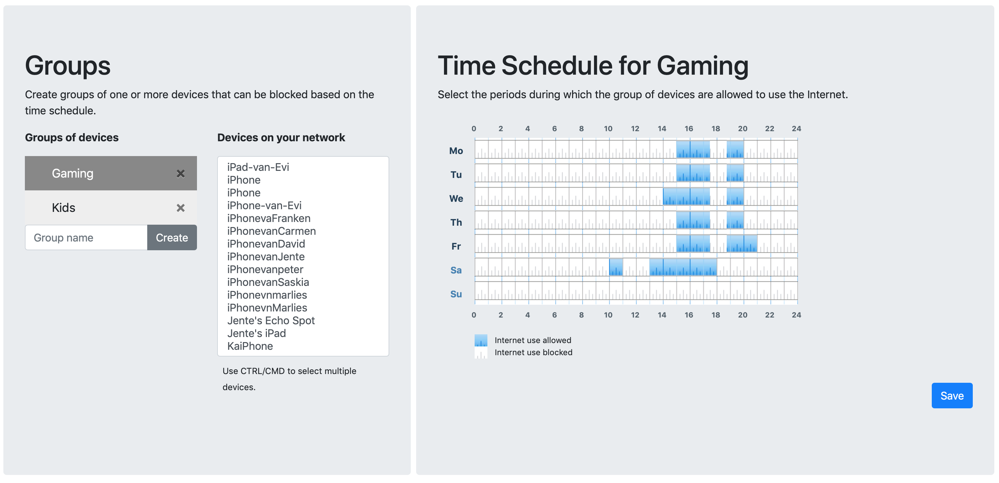

# Unifi-parental

Time based block/unblock of clients for a Unifi based network.

Requires a Unifi Controller accessible.

Uses:
* node-unifi to access the Unifi Controller.
* node-schedule for cron like scheduling of the block/unblock actions

## Installation
Clone the repo and then do:
```
npm install
```

Add Unifi Controller details and login information to `config.json` and `.env` respectively - see `-sample` files for examples

Start the server:
```
DEBUG=unifi-parental:* npm start
```

Fire up a browser and head to http://localhost:4000/ to access the interface.



Click `OK` to send the schedule to the server and to schedule the block/unblock actions. This is required to be done initially every time the server is started. (ie: the schedule is not applied on startup of the server)

## Note
The code (javascript, html, css, images and fonts) for the time schedule chart were saved using a browser from a Fritz!Box 7390 ADSL modem/router. The source files served to the browser contained no license information.

The file `public\js\timer.js` has been modified to return data in a more usable format for both the client and server. Portions of this file have been used in the server side code for scheduling block/unblock actions.

## TODO
* Generate block/unblock schedule on startup
* Keep track of the login state with the Unifi Controller better
* Error handling if the login state is stale
* Tidy up the client UI
  * make the Cancel button actually do something